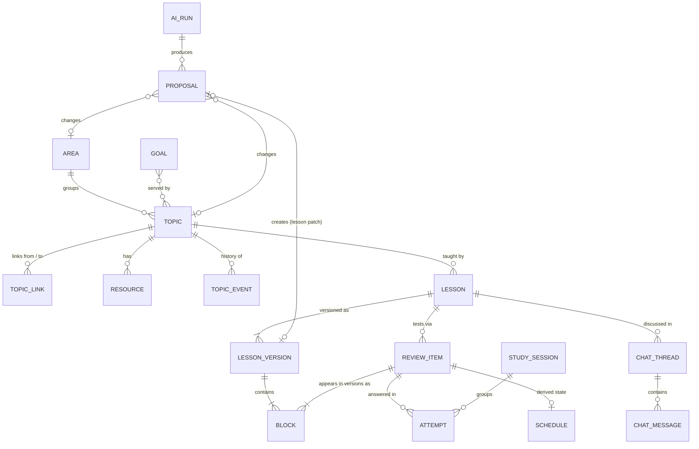

# Learning Studio — Data Model

How Learning Studio stores what you want to learn, what you've been taught and
what you can actually recall. It covers all three phases; each table is tagged
with the phase that introduces it. Later phases only **add** tables and never
change existing ones.

The model is described at three levels:

1. **Conceptual**: the main things the app stores and how they relate. No columns.
2. **Logical**: entities, attributes, keys and business rules, independent of
   any database.
3. **Physical**: SQLite DDL, with notes on moving to Postgres.

Related: [phase-1-plan.md](phase-1-plan.md), [phase-2-3-plan.md](phase-2-3-plan.md).

---

## Design principles

| # | Principle | Consequence in the model |
|---|-----------|--------------------------|
| 1 | **Metrics are measured, never typed in.** Mastery comes from test attempts plus spaced repetition. | No `progress` or `mastery` column anywhere. Mastery is computed from `attempts` and `review_item_state`. |
| 2 | **The user can override the status, never the metric.** | `topics.status_override` changes the *displayed* status. The measured mastery % is always shown next to it. |
| 3 | **AI proposes, the user decides.** | All AI-driven changes go through `proposals`. Every AI call is logged in `ai_runs`. |
| 4 | **Archive, don't delete.** | `archived_at` on user-facing entities. Merged topics keep `merged_into_id`. Attempts are never orphaned. |
| 5 | **History is append-only.** | Lesson versions, attempts and topic events are only ever inserted. Rolling back a lesson writes a new version. |
| 6 | **Derived state is a cache you can rebuild.** | `review_item_state` can be rebuilt by replaying `attempts` through the scheduler, so changing the algorithm is safe. |
| 7 | **Flexible content goes in versioned JSON; structure goes in columns.** | Lesson blocks and proposal payloads are JSON with a schema version. Anything you filter, join or count on is a real column. |

---

## 1. Conceptual model

### Domains

| Domain | Concepts | Purpose |
|--------|----------|---------|
| **Map** | Area, Topic, Topic link, Goal, Resource | What you want to learn and how the pieces relate. |
| **History** | Topic event | Who changed what about a topic, and when (overrides, moves, merges, archiving). |
| **Content** | Lesson, Lesson version, Block | What you are taught. Blocks are fixed widget types filled with data. |
| **Assessment** | Review item, Study session, Attempt, Schedule | What you can actually recall, and when to test it next. |
| **AI & governance** | AI run, Proposal, AI text cache | Every AI call is logged. Every AI suggestion waits for your decision. |
| **Co-authoring** *(Phase 3)* | Chat thread, Chat message | Conversations with the agent about a lesson. |

### Diagram



### Concepts in plain words

- **Area**: a broad field you care about, e.g. *Data engineering*. It's the
  card on the home page. It holds topics.
- **Topic**: one learnable thing, e.g. *dbt incremental models*. It's the
  central entity. It sits in at most one area; a topic with no area is in the
  inbox.
- **Topic link**: a directed, typed relationship between two topics:
  *prerequisite of*, *related to* or *part of*.
- **Goal**: an outcome with an optional date, e.g. *internal article on AI and
  data engineering*. Topics serve goals (many-to-many).
- **Resource**: a link, book, video, course or note attached to a topic.
- **Topic event**: an immutable history entry: created, renamed, moved area,
  status override set/cleared, merged, archived.
- **Lesson / Lesson version / Block**: a lesson teaches one topic. Its content
  is an ordered list of blocks of fixed widget types, stored as an append-only
  series of versions.
- **Review item**: something testable. It's one interactive block of a lesson,
  identified by its stable block id, so it survives edits to the lesson. This
  is the "card" in spaced-repetition terms.
- **Study session**: one sitting: working through a lesson, a review queue, or
  a placement test.
- **Attempt**: one answer to one review item: what you answered, whether it was
  right, how confident you were.
- **Schedule**: the spaced-repetition state of a review item: when it is next
  due, how stable the memory is. It's derived from attempts.
- **Mastery** *(derived, not stored)*: how much of a topic you can recall
  *right now*. It's computed from the schedules of the topic's review items.
- **AI run**: one logged call to Claude: prompt, model, raw output, validation
  result.
- **Proposal**: one AI suggestion waiting for a decision (create a topic,
  link two topics, patch a lesson…).
- **AI text cache**: AI-written text that is cheap to reuse, e.g. the "why this
  next" lines on Next up.

### How status works

Status was typed in by hand in the original plan. Here it comes from
measurement:

```
measured mastery  ──►  derived status  ──┐
                                         ├──►  effective status (shown, used by Next up)
user override (optional) ────────────────┘
```

- **Mastery %** = coverage × retention. Coverage is the share of the topic's
  review items you have been tested on at least once. Retention is the average
  probability that you would recall those items *today*, which the scheduler
  calculates. Mastery therefore **decays** if you stop reviewing, which keeps it
  honest.
- **Derived status**:
  - `backlog`: no attempts yet;
  - `solid`: mastery ≥ 80 %, every scheduled item has been tested, and every
    item has reached the scheduler's `review` state;
  - `learning`: anything in between.
  
  Thresholds are configuration, not schema.
- **Override**: you can set `backlog`, `learning` or `solid` by hand, e.g.
  "I want to learn this now", or "I already know this" (shown as
  *self-assessed*).
  - The override wins for display and for Next up.
  - The measured mastery % is always shown beside it.
  - An override **clears itself** once the derived status equals it. For
    example, you set *learning*, take your first test, and derived becomes
    *learning*.
  - A mismatch (override *solid*, measured *learning*) is flagged in the UI.
- **Phase 1** has no tests yet, so derived status is always `backlog` and the
  override is the only input. Nothing changes in the model when Phase 2 adds
  measurement.

---

## 2. Logical model

### Conventions

- Every entity has a surrogate key `id`: a time-ordered UUID (UUIDv7) stored as
  text. Why:
  - ids can be created before saving, so a proposal can refer to a topic that
    another pending proposal will create;
  - they are safe to export and import;
  - they move to Postgres `uuid` unchanged.
- All timestamps are UTC instants. Dates without a time (`target_date`) are
  calendar dates.
- **Enumerations** are listed below. They are validated in the application
  schema layer, not by database constraints, so adding a value needs no
  migration. Only rules that will never change become database constraints.
- `archived_at` marks soft deletion. Rows are only hard-deleted from join
  tables and for `topic_links`, where the history lives in proposals and
  events.

### Logical diagram

```mermaid
erDiagram
  areas {
    id id PK
    text name "AK among live rows, case-insensitive"
    text summary
    int position
    instant archived_at
    instant created_at
    instant updated_at
  }
  topics {
    id id PK
    text title "AK among live rows, case-insensitive"
    text summary
    text why_i_care
    id area_id FK "nullable = inbox"
    enum status_override "nullable"
    text status_override_note
    instant status_override_at
    id merged_into_id FK "self, nullable"
    instant archived_at
    instant created_at
    instant updated_at
  }
  topic_links {
    id id PK
    id from_topic_id FK
    id to_topic_id FK
    enum link_type
    text rationale
    id source_proposal_id FK
    instant created_at
  }
  topic_events {
    id id PK
    id topic_id FK
    enum event_type
    text from_value
    text to_value
    enum actor
    id proposal_id FK
    instant created_at
  }
  goals {
    id id PK
    text title
    text description
    date target_date
    enum status
    instant created_at
    instant updated_at
  }
  topic_goals {
    id topic_id PK,FK
    id goal_id PK,FK
    instant created_at
  }
  resources {
    id id PK
    id topic_id FK
    enum kind
    text title
    text url
    text note
    instant archived_at
    instant created_at
  }
  ai_runs {
    id id PK
    enum task
    text prompt_name
    text prompt_hash
    text model
    json request
    json attempts_log
    json result
    enum outcome
    int attempt_count
    int input_tokens
    int output_tokens
    int latency_ms
    instant created_at
  }
  proposals {
    id id PK
    id ai_run_id FK
    enum kind
    enum target_type
    id target_id
    id area_id FK "scope"
    id topic_id FK "scope"
    json payload
    int payload_version
    text rationale
    id depends_on_id FK
    enum status
    instant decided_at
    text decision_note
    id applied_entity_id
    instant created_at
  }
  ai_text_cache {
    id id PK
    enum purpose
    id subject_id
    text input_hash
    text text
    id ai_run_id FK
    instant created_at
  }
  lessons {
    id id PK
    id topic_id FK
    text title
    enum origin
    instant archived_at
    instant created_at
    instant updated_at
  }
  lesson_versions {
    id id PK
    id lesson_id FK
    int version_no "AK with lesson_id"
    int schema_version
    json blocks
    enum created_by
    text change_note
    id based_on_version_id FK
    id source_proposal_id FK
    id ai_run_id FK
    instant created_at
  }
  review_items {
    id id PK
    id lesson_id FK
    text block_id "AK with lesson_id"
    enum block_type
    bool is_scheduled
    id first_version_id FK
    instant retired_at
    instant created_at
  }
  study_sessions {
    id id PK
    enum kind
    id lesson_version_id FK
    instant started_at
    instant completed_at
  }
  attempts {
    id id PK
    id review_item_id FK
    id session_id FK
    id lesson_version_id FK
    json answer
    bool is_correct
    decimal score
    int confidence
    int rating
    int duration_ms
    instant answered_at
  }
  review_item_state {
    id review_item_id PK,FK
    text scheduler
    text scheduler_version
    enum state
    decimal stability
    decimal difficulty
    instant due_at
    instant last_reviewed_at
    int reps
    int lapses
    instant computed_at
  }
  chat_threads {
    id id PK
    id lesson_id FK
    text title
    instant archived_at
    instant created_at
  }
  chat_messages {
    id id PK
    id thread_id FK
    enum role
    text content
    id proposal_id FK
    id ai_run_id FK
    instant created_at
  }

  areas ||--o{ topics : groups
  topics ||--o{ topic_links : from
  topics ||--o{ topic_links : to
  topics |o--o{ topics : "merged into"
  topics ||--o{ topic_events : has
  topics ||--o{ topic_goals : ""
  goals ||--o{ topic_goals : ""
  topics ||--o{ resources : has
  ai_runs ||--o{ proposals : produces
  proposals |o--o{ proposals : "depends on"
  ai_runs ||--o{ ai_text_cache : wrote
  topics ||--o{ lessons : "taught by"
  lessons ||--|{ lesson_versions : versions
  lessons ||--o{ review_items : tests
  review_items ||--o{ attempts : ""
  study_sessions ||--o{ attempts : ""
  lesson_versions ||--o{ attempts : "content answered"
  review_items ||--o| review_item_state : schedule
  lessons ||--o{ chat_threads : ""
  chat_threads ||--o{ chat_messages : ""
```

### Entity notes, phases and enumerations

| Entity | Phase | Notes | Enumerations |
|--------|-------|-------|--------------|
| `areas` | 1 | `position` gives the order shown on the home page (01, 02…). | – |
| `topics` | 1 | The override columns are set and cleared together. See *How status works*. | `status_override`: `backlog` · `learning` · `solid` |
| `topic_links` | 1 | Directed. See the link rules below. | `link_type`: `prerequisite_of` · `related_to` · `part_of` |
| `topic_events` | 1 | Append-only audit trail for topics. | `event_type`: `created` · `renamed` · `area_changed` · `status_override_set` · `status_override_cleared` · `status_override_resolved` · `merged` · `archived` · `restored`. `actor`: `user` · `system` · `proposal` |
| `goals` | 1 | Only `active` goals count towards Next up. | `status`: `active` · `achieved` · `dropped` |
| `topic_goals` | 1 | Many-to-many join. | – |
| `resources` | 1 | Needs at least one of `url` or `note`. | `kind`: `link` · `book` · `video` · `course` · `note` |
| `ai_runs` | 1 | One row per logical call. `attempts_log` holds each try's raw output and validation error, which is the material for prompt tuning. | `task`: `capture` · `organise` · `next_up_why` · `plan_lesson` · `generate_lesson` · `lesson_patch` · `optimise` · `placement`. `model` is the model chosen in `settings` at call time. `outcome`: `ok` · `invalid` · `error` |
| `proposals` | 1 | `target_type` + `target_id` is a loose reference with no foreign key. Payload v2: `create_topic` may set `parent_topic_id`, and accepting it also links the new topic under that parent. `lesson_patch` holds `lesson_id`, `base_version_id`, `change_note` and block operations (`replace`, `add`, `remove`, `move`); accepting applies them to the base version as a new version, and fails if the lesson has a newer version. `area_id` / `topic_id` are real foreign keys used for scoping ("2 suggestions to review"). `applied_entity_id` records what accepting the proposal created. | `kind`: `create_topic` · `update_topic` · `move_topic` · `merge_topics` · `archive_topic` · `create_area` · `update_area` · `create_link` · `remove_link` · `lesson_patch` (P3). `status`: `pending` · `accepted` · `rejected` · `superseded` · `failed` |
| `ai_text_cache` | 1 | Reused while `input_hash` (a hash of the facts the text was written from) is unchanged. | `purpose`: `next_up_why` |
| `lessons` | 2 | One topic can have several lessons. A placement test is a lesson with `origin = placement`: one concept block (its scope) and questions, no project. | `origin`: `ai` · `user` · `imported_article` · `placement` |
| `lesson_versions` | 2 | Append-only. Rollback or patch = a new row with `based_on_version_id`. The latest version is the highest `version_no`. | `created_by`: `ai` · `user` |
| `review_items` | 2 | One per interactive block id per lesson. Created the first time that block id appears. Retired when a later version drops it. | `block_type` = the block's `type` |
| `study_sessions` | 2 | Groups attempts. `lesson_version_id` is set when `kind` is `lesson` or `placement`. | `kind`: `lesson` · `review` · `placement` |
| `attempts` | 2 | Immutable. `rating` is stored, not recomputed, so replaying attempts gives the same schedule even if the mapping rules change later. | `confidence`: 1 guessing · 2 fairly sure · 3 certain. `rating`: 1 Again · 2 Hard · 3 Good · 4 Easy |
| `review_item_state` | 2 | **Derived cache.** Rebuild it by replaying attempts in time order through the scheduler named in `scheduler_version`. | `state`: `new` · `learning` · `review` · `relearning` |
| `settings` | 2.5 | Key/value app settings: `model` (the Claude model id) and `profile` (the learner profile sent with every Claude call). | – |
| `lesson_requests` | 2.5 | The Build lesson conversation: level, brief, planner turns and the latest plan. `lesson_id` is set once built. A working record, so `messages_json` grows while `status = open`. | `level`: `fundamentals` · `applied` · `advanced`. `status`: `open` · `built` · `abandoned` |
| `chat_threads`, `chat_messages` | 3 | Co-author notes, one thread per lesson. A user message may be about one block (`block_id`). An assistant message may carry a `lesson_patch` proposal. User messages are also sent with future lessons for the topic. | `role`: `user` · `assistant` |
| `scheduler_params` | 3 | Fitted FSRS weights; at most one active per scheduler. Activating or deactivating a row replays every attempt. `params_json` holds `{ method, w, pairs }`. | – |

### Business rules

**Map**
1. A topic belongs to at most one area. `area_id = NULL` means *inbox*.
2. Live (non-archived) topic titles are unique, ignoring case. The same rule
   applies to area names.
3. Links:
   - no self-links;
   - at most one link of each type per ordered pair;
   - `related_to` is symmetric, so it is stored once with `from_topic_id < to_topic_id`;
   - `part_of` points child → parent, and a topic has at most one parent;
   - the hierarchy is area › topic › sub-topic: a parent cannot itself be a
     sub-topic, and a topic with sub-topics cannot become one (this also rules
     out `part_of` loops);
   - a sub-topic is in its parent's area: linking moves it there, moving the
     parent moves its sub-topics;
   - `prerequisite_of` must not form a cycle. This is checked in the
     application before inserting.
4. Merging B into A, in one transaction:
   - move B's links, goals, resources and lessons to A;
   - set `B.merged_into_id = A` and `B.archived_at = now()`;
   - write a `merged` event on both topics.
   
   An archived topic with `merged_into_id` must point at a live topic (follow
   the chain if needed).

**Status**

5. A topic's override columns are all set or all `NULL`. When the derived
   status equals the override, the system clears it and writes a
   `status_override_resolved` event. An override that measurement will never
   equal (e.g. *backlog* on a topic that has attempts) stays until you clear it.

**Proposals**

6. A proposal is decided once:
   - `pending` → `accepted` | `rejected` | `superseded` | `failed`;
   - accepting applies the change and records `applied_entity_id`, in one
     transaction;
   - a proposal with `depends_on_id` can only be accepted after the proposal
     it depends on.

**Lessons and assessment**

7. Lesson versions, attempts, topic events and AI runs are never updated or deleted.
8. Block ids are unique within a version. **A block keeps its id across
   versions as long as it tests the same thing.** If a change alters what is
   tested, the block gets a new id: a new review item starts and the old one is
   retired. This is how a schedule is "reset".
9. Concept, steps and diagram blocks have no review item. `project_prompt` gets
   a review item with `is_scheduled = false`: it is logged but never scheduled
   and never counts towards mastery.

### Derived values (computed by the app, never stored)

| Value | Definition |
|-------|------------|
| Retrievability of an item | The scheduler's probability of recall at `now`, from `stability` and the time since `last_reviewed_at`. |
| Topic coverage | Scheduled live items with ≥ 1 attempt ÷ all scheduled live items of the topic's live lessons. |
| Topic retention | Mean retrievability over attempted scheduled items. |
| **Topic mastery %** | `100 × coverage × retention`. Topics with no items show *not measured*, not 0 %. |
| Derived status | See *How status works*. |
| Effective status | `status_override ?? derived status`. |
| Reviews due | Count of live scheduled items with `due_at <= now`. |
| Confidently wrong | Attempts with `is_correct = 0 AND confidence = 3`. A signal for the optimise loop. |
| Area summary | Count of topics by effective status, mean mastery of measured topics, pending proposals where `area_id` = the area. |

Mastery is computed in application code, not in SQL views. It depends on
`now` and on the scheduler library's retrievability formula. At a few hundred
topics this costs nothing.

---

## 3. Physical model (SQLite)

### Storage conventions

| Logical type | SQLite | Postgres later |
|--------------|--------|----------------|
| `id` | `TEXT` (UUIDv7, lowercase) | `uuid` |
| `instant` | `TEXT`, ISO-8601 UTC `YYYY-MM-DDTHH:MM:SS.sssZ` (sorts correctly as text) | `timestamptz` |
| `date` | `TEXT` `YYYY-MM-DD` | `date` |
| `bool` | `INTEGER` 0/1 + `CHECK` | `boolean` |
| `json` | `TEXT` + `CHECK (json_valid(...))` | `jsonb` |
| `enum` | `TEXT`, validated in the app | `text` (or a lookup table if needed) |
| `decimal` | `REAL` | `double precision` |

### Connection settings (every connection)

```sql
PRAGMA foreign_keys = ON;      -- OFF by default in SQLite; without this no FK is enforced
PRAGMA journal_mode = WAL;     -- concurrent reads while writing
PRAGMA busy_timeout = 5000;
```

### Migrations

- Migrations are numbered SQL files in `backend/src/db/migrations/`, applied on start and tracked in a `schema_migrations` table (see [phase-1-plan.md](phase-1-plan.md#stack)). Never edit a file once it has been applied; add a new one.
- Each phase is one or more **additive** migrations.
- SQLite cannot change a column or constraint in place. A migration that needs
  to do so rebuilds the table (create new, copy, drop, rename). Another reason to
  keep evolving enums out of `CHECK` constraints.

### DDL — Phase 1

```sql
CREATE TABLE areas (
  id           TEXT PRIMARY KEY,
  name         TEXT NOT NULL,
  summary      TEXT,
  position     INTEGER NOT NULL DEFAULT 0,
  archived_at  TEXT,
  created_at   TEXT NOT NULL,
  updated_at   TEXT NOT NULL
);
CREATE UNIQUE INDEX ux_areas_name_live ON areas (lower(name)) WHERE archived_at IS NULL;

CREATE TABLE topics (
  id                    TEXT PRIMARY KEY,
  title                 TEXT NOT NULL,
  summary               TEXT,
  why_i_care            TEXT,
  area_id               TEXT REFERENCES areas (id),
  status_override       TEXT,
  status_override_note  TEXT,
  status_override_at    TEXT,
  merged_into_id        TEXT REFERENCES topics (id),
  archived_at           TEXT,
  created_at            TEXT NOT NULL,
  updated_at            TEXT NOT NULL,
  CHECK ((status_override IS NULL) = (status_override_at IS NULL)),
  CHECK (merged_into_id IS NULL OR (merged_into_id <> id AND archived_at IS NOT NULL))
);
CREATE UNIQUE INDEX ux_topics_title_live ON topics (lower(title)) WHERE archived_at IS NULL;
CREATE INDEX ix_topics_area ON topics (area_id) WHERE archived_at IS NULL;

CREATE TABLE ai_runs (
  id             TEXT PRIMARY KEY,
  task           TEXT NOT NULL,
  prompt_name    TEXT NOT NULL,                 -- file under prompts/
  prompt_hash    TEXT NOT NULL,                 -- sha256 of the prompt text actually sent
  model          TEXT NOT NULL,
  request_json   TEXT NOT NULL CHECK (json_valid(request_json)),
  attempts_json  TEXT NOT NULL CHECK (json_valid(attempts_json)),  -- [{raw_output, validation_error}]
  result_json    TEXT CHECK (result_json IS NULL OR json_valid(result_json)),
  outcome        TEXT NOT NULL,
  attempt_count  INTEGER NOT NULL CHECK (attempt_count >= 1),
  input_tokens   INTEGER,
  output_tokens  INTEGER,
  latency_ms     INTEGER,
  created_at     TEXT NOT NULL
);
CREATE INDEX ix_ai_runs_task ON ai_runs (task, created_at);

CREATE TABLE proposals (
  id                 TEXT PRIMARY KEY,
  ai_run_id          TEXT REFERENCES ai_runs (id),     -- NULL if user-originated
  kind               TEXT NOT NULL,
  target_type        TEXT,
  target_id          TEXT,                             -- loose reference, NULL for creates
  area_id            TEXT REFERENCES areas (id),
  topic_id           TEXT REFERENCES topics (id),
  payload_json       TEXT NOT NULL CHECK (json_valid(payload_json)),
  payload_version    INTEGER NOT NULL DEFAULT 1,
  rationale          TEXT,
  depends_on_id      TEXT REFERENCES proposals (id),
  status             TEXT NOT NULL DEFAULT 'pending',
  decided_at         TEXT,
  decision_note      TEXT,
  applied_entity_id  TEXT,
  created_at         TEXT NOT NULL,
  CHECK ((status = 'pending') = (decided_at IS NULL))
);
CREATE INDEX ix_proposals_status_area  ON proposals (status, area_id);
CREATE INDEX ix_proposals_status_topic ON proposals (status, topic_id);
CREATE INDEX ix_proposals_run          ON proposals (ai_run_id);

CREATE TABLE topic_events (
  id           TEXT PRIMARY KEY,
  topic_id     TEXT NOT NULL REFERENCES topics (id),
  event_type   TEXT NOT NULL,
  from_value   TEXT,
  to_value     TEXT,
  actor        TEXT NOT NULL,
  proposal_id  TEXT REFERENCES proposals (id),
  created_at   TEXT NOT NULL
);
CREATE INDEX ix_topic_events_topic ON topic_events (topic_id, created_at);

CREATE TABLE topic_links (
  id                  TEXT PRIMARY KEY,
  from_topic_id       TEXT NOT NULL REFERENCES topics (id),
  to_topic_id         TEXT NOT NULL REFERENCES topics (id),
  link_type           TEXT NOT NULL,
  rationale           TEXT,
  source_proposal_id  TEXT REFERENCES proposals (id),
  created_at          TEXT NOT NULL,
  CHECK (from_topic_id <> to_topic_id),
  CHECK (link_type <> 'related_to' OR from_topic_id < to_topic_id),
  UNIQUE (from_topic_id, to_topic_id, link_type)
);
CREATE INDEX ix_topic_links_to ON topic_links (to_topic_id, link_type);
CREATE UNIQUE INDEX ux_topic_links_one_parent ON topic_links (from_topic_id) WHERE link_type = 'part_of';

CREATE TABLE goals (
  id           TEXT PRIMARY KEY,
  title        TEXT NOT NULL,
  description  TEXT,
  target_date  TEXT,
  status       TEXT NOT NULL DEFAULT 'active',
  created_at   TEXT NOT NULL,
  updated_at   TEXT NOT NULL
);

CREATE TABLE topic_goals (
  topic_id    TEXT NOT NULL REFERENCES topics (id) ON DELETE CASCADE,
  goal_id     TEXT NOT NULL REFERENCES goals (id)  ON DELETE CASCADE,
  created_at  TEXT NOT NULL,
  PRIMARY KEY (topic_id, goal_id)
);
CREATE INDEX ix_topic_goals_goal ON topic_goals (goal_id);

CREATE TABLE resources (
  id           TEXT PRIMARY KEY,
  topic_id     TEXT NOT NULL REFERENCES topics (id),
  kind         TEXT NOT NULL,
  title        TEXT NOT NULL,
  url          TEXT,
  note         TEXT,
  archived_at  TEXT,
  created_at   TEXT NOT NULL,
  CHECK (url IS NOT NULL OR note IS NOT NULL)
);
CREATE INDEX ix_resources_topic ON resources (topic_id);

CREATE TABLE ai_text_cache (
  id          TEXT PRIMARY KEY,
  purpose     TEXT NOT NULL,
  subject_id  TEXT NOT NULL,
  input_hash  TEXT NOT NULL,
  text        TEXT NOT NULL,
  ai_run_id   TEXT REFERENCES ai_runs (id),
  created_at  TEXT NOT NULL,
  UNIQUE (purpose, subject_id, input_hash)
);
```

### DDL — Phase 2

```sql
CREATE TABLE lessons (
  id           TEXT PRIMARY KEY,
  topic_id     TEXT NOT NULL REFERENCES topics (id),
  title        TEXT NOT NULL,
  origin       TEXT NOT NULL,
  archived_at  TEXT,
  created_at   TEXT NOT NULL,
  updated_at   TEXT NOT NULL
);
CREATE INDEX ix_lessons_topic ON lessons (topic_id);

CREATE TABLE lesson_versions (
  id                   TEXT PRIMARY KEY,
  lesson_id            TEXT NOT NULL REFERENCES lessons (id),
  version_no           INTEGER NOT NULL CHECK (version_no >= 1),
  schema_version       INTEGER NOT NULL,
  blocks_json          TEXT NOT NULL CHECK (json_valid(blocks_json)),
  created_by           TEXT NOT NULL,
  change_note          TEXT,
  based_on_version_id  TEXT REFERENCES lesson_versions (id),
  source_proposal_id   TEXT REFERENCES proposals (id),
  ai_run_id            TEXT REFERENCES ai_runs (id),
  created_at           TEXT NOT NULL,
  UNIQUE (lesson_id, version_no)
);

CREATE TABLE review_items (
  id                TEXT PRIMARY KEY,
  lesson_id         TEXT NOT NULL REFERENCES lessons (id),
  block_id          TEXT NOT NULL,
  block_type        TEXT NOT NULL,
  is_scheduled      INTEGER NOT NULL CHECK (is_scheduled IN (0, 1)),
  first_version_id  TEXT NOT NULL REFERENCES lesson_versions (id),
  retired_at        TEXT,
  created_at        TEXT NOT NULL,
  UNIQUE (lesson_id, block_id)
);

CREATE TABLE study_sessions (
  id                 TEXT PRIMARY KEY,
  kind               TEXT NOT NULL,
  lesson_version_id  TEXT REFERENCES lesson_versions (id),
  started_at         TEXT NOT NULL,
  completed_at       TEXT
);

CREATE TABLE attempts (
  id                 TEXT PRIMARY KEY,
  review_item_id     TEXT NOT NULL REFERENCES review_items (id),
  session_id         TEXT NOT NULL REFERENCES study_sessions (id),
  lesson_version_id  TEXT NOT NULL REFERENCES lesson_versions (id),
  answer_json        TEXT NOT NULL CHECK (json_valid(answer_json)),
  is_correct         INTEGER CHECK (is_correct IN (0, 1)),          -- NULL = not auto-gradable
  score              REAL    CHECK (score BETWEEN 0 AND 1),
  confidence         INTEGER CHECK (confidence BETWEEN 1 AND 3),
  rating             INTEGER CHECK (rating BETWEEN 1 AND 4),        -- NULL = not scheduled
  duration_ms        INTEGER,
  answered_at        TEXT NOT NULL
);
CREATE INDEX ix_attempts_item    ON attempts (review_item_id, answered_at);
CREATE INDEX ix_attempts_session ON attempts (session_id);

CREATE TABLE review_item_state (
  review_item_id     TEXT PRIMARY KEY REFERENCES review_items (id),
  scheduler          TEXT NOT NULL,     -- 'fsrs'
  scheduler_version  TEXT NOT NULL,     -- library version + parameter-set hash
  state              TEXT NOT NULL,
  stability          REAL,
  difficulty         REAL,
  due_at             TEXT NOT NULL,
  last_reviewed_at   TEXT,
  reps               INTEGER NOT NULL DEFAULT 0,
  lapses             INTEGER NOT NULL DEFAULT 0,
  computed_at        TEXT NOT NULL
);
CREATE INDEX ix_review_item_state_due ON review_item_state (due_at);
```

### DDL — Phase 2.5

```sql
CREATE TABLE settings (
  key         TEXT PRIMARY KEY,
  value_json  TEXT NOT NULL CHECK (json_valid(value_json)),
  updated_at  TEXT NOT NULL
);

CREATE TABLE lesson_requests (
  id             TEXT PRIMARY KEY,
  topic_id       TEXT NOT NULL REFERENCES topics (id),
  level          TEXT,
  brief          TEXT,
  messages_json  TEXT NOT NULL CHECK (json_valid(messages_json)),          -- [{role, content}]
  plan_json      TEXT CHECK (plan_json IS NULL OR json_valid(plan_json)),  -- latest plan from the planner
  status         TEXT NOT NULL,
  lesson_id      TEXT REFERENCES lessons (id),
  created_at     TEXT NOT NULL,
  updated_at     TEXT NOT NULL
);
CREATE INDEX ix_lesson_requests_topic ON lesson_requests (topic_id, created_at);
```

### DDL — Phase 3

```sql
CREATE TABLE chat_threads (
  id           TEXT PRIMARY KEY,
  lesson_id    TEXT NOT NULL REFERENCES lessons (id),
  title        TEXT,
  archived_at  TEXT,
  created_at   TEXT NOT NULL
);
CREATE INDEX ix_chat_threads_lesson ON chat_threads (lesson_id);

CREATE TABLE chat_messages (
  id           TEXT PRIMARY KEY,
  thread_id    TEXT NOT NULL REFERENCES chat_threads (id),
  role         TEXT NOT NULL,
  content      TEXT NOT NULL,
  block_id     TEXT,                              -- the block a note is about, if any
  proposal_id  TEXT REFERENCES proposals (id),
  ai_run_id    TEXT REFERENCES ai_runs (id),
  created_at   TEXT NOT NULL
);
CREATE INDEX ix_chat_messages_thread ON chat_messages (thread_id, created_at);

CREATE TABLE scheduler_params (
  id                   TEXT PRIMARY KEY,
  scheduler            TEXT NOT NULL,
  params_json          TEXT NOT NULL CHECK (json_valid(params_json)),
  trained_on_attempts  INTEGER NOT NULL,
  is_active            INTEGER NOT NULL CHECK (is_active IN (0, 1)),
  created_at           TEXT NOT NULL
);
CREATE UNIQUE INDEX ux_scheduler_params_active ON scheduler_params (scheduler) WHERE is_active = 1;
```

### Foreign keys and deletion

- Foreign keys use the default `NO ACTION`, which in practice blocks the
  delete. The app archives rows instead of deleting them.
- Only join rows (`topic_goals`) cascade.
- `topic_links` rows are hard-deleted when a link is removed. The history lives
  in the `remove_link` proposal or a topic event.
- SQLite does not index foreign keys automatically. Every foreign key that is
  queried has an index above.

### Postgres portability checklist

- The type mapping is in the table above.
- Partial unique indexes and `lower(...)` expression indexes work the same way.
- Replace `json_valid` checks with `jsonb` columns.
- Optional: turn the stable enums (`link_type`, `rating` meanings) into lookup
  tables if other tools will read the database.
- Nothing in the model depends on SQLite-only behaviour except the `PRAGMA`s.
